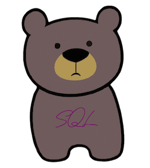

# BearSQL


Bare words SQL macro for Clojure.



What if you could **just write SQL** as is and still retain safety of parameters.
With BearSQL you can!

```clojure
;; Using ambient dynamic connection
(let [id 1]
  (q select name from product where id = @id))
;; => [{:product/name "Fine leather jacket"}]
```

BearSQL macros provide a minimal symbols to SQL conversion at compile time
while still allowing you to have runtime input parameters.

You can also pass in the database by using a configuration map as the first
argument.

## Syntax rules

- Any symbol is converted to SQL as is (with dashes converted to underscores)
- Symbol `as` is special and allows aliasing
- Vectors are turned into comma separated lists (because comma is whitespace in Clojure) except special (see below)
- Lists are recursively converted and surrounded with parenthesis
- Deref (`@form`) escapes back to Clojure code and uses that value as SQL query parameter
- Strings are passed in as SQL-quoted strings
- Any other Clojure value is used as input parameter as is
- Vector that begins with `:raw` is special and can be used to include any raw SQL fragment and parameters into the query

See unit tests for examples of usage.
